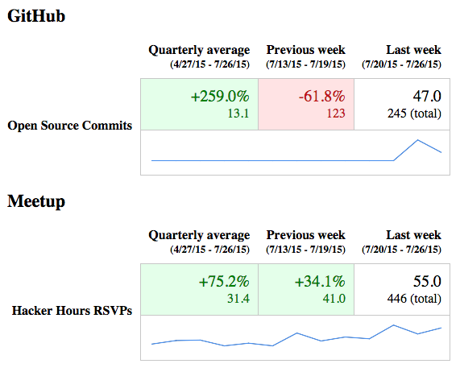

# Tricle [![Build Status]](https://travis-ci.org/afeld/tricle) [![Code Climate]](https://codeclimate.com/github/afeld/tricle) [![Gem Version]](http://badge.fury.io/rb/tricle)

Automated metrics reporting via email.  It's datastore-agnostic, so you can query SQL, MongoDB, external APIs, etc. to generate the stats you need. Uses [sparkle](https://github.com/afeld/sparkle) for generating sparklines. Example implementations:

* [github.com/afeld/tricle-afeld](https://github.com/afeld/tricle-afeld) ([live demo](http://tricle.afeld.me/weekly_metrics))
* [github.com/dobtco/metrics](https://github.com/dobtco/metrics)



## Installation

This gem can be used within an existing project (e.g. a Rails app), or standalone.

```ruby
# Gemfile
gem 'tricle', '~> 0.2.0'


# Rakefile
require 'your/tricle/subclasses'
require 'tricle/tasks'


# your/config/file.rb

# unless you already have ActionMailer set up
ActionMailer::Base.raise_delivery_errors = true
ActionMailer::Base.smtp_settings = {
  # ...
}

# Optional: Override the start day of the reports (Rails >= 4.0.3 only)
# http://api.rubyonrails.org/classes/Date.html#method-i-beginning_of_week-3D
Date.beginning_of_week = :monday
```

See [the ActionMailer guide](http://guides.rubyonrails.org/action_mailer_basics.html#action-mailer-configuration) for configuration details.  Finally, execute:

```bash
bundle
```

## Usage

### Metrics

For each metric you want to report, create a new subclass of `Tricle::Metric` that implements `#size_for_range` and `#total`:

```ruby
class MyMetric < Tricle::Metric

  # Retrieve the value of this metric for the provided time period. Generally
  # this will be the count/value added/removed. Not necessary if #items_for_range
  # is defined.
  #
  # @param start_at [Time]
  # @param end_at [Time] non-inclusive
  # @return [Fixnum]
  def size_for_range(start_at, end_at)
    # ...
  end

  # Optional: Retrieve the cumulative value for this metric. If not defined,
  # the total won't be displayed in the mailer.
  #
  # @return [Fixnum] the grand total
  def total
    # ...
  end

  # Optional: Only necessary if using `list` for this Metric within your Mailer.
  #
  # @param start_at [Time]
  # @param end_at [Time] non-inclusive
  # @return [Enumerator]
  def items_for_range(start_at, end_at)
    # ...
  end

end
```

If you would like finer-grain optimization, the methods included from the [`Aggregation`](lib/tricle/arregation.rb) mixin can be overridden.

### ActiveRecord Metrics

You can inherit from [`Tricle::ActiveRecordMetric`](lib/tricle/active_record_metric.rb) for even easier setup. By default, Tricle looks for records with a `created_at` timestamp between the `start_at` and `end_at` times.

```ruby
# app/metrics/new_users.rb
class NewUsers < Tricle::ActiveRecordMetric

  # Apply any default scopes you need
  def items
    User.where(deleted_at: nil)
  end

end
```

You can also override the `time_column` method to split the time intervals based on that value. For example, to see records that have been updated:

```ruby
# app/metrics/new_users.rb
class NewUsers < Tricle::ActiveRecordMetric

  def items
    User.where(deleted_at: nil)
  end

  def column
    'updated_at'
  end

end
```

#### "Lower is better" metrics

By default, Tricle highlights numbers that increased in green, and those that decreased in red. If you have a metric where a *lower* number is considered better, you'll want to override the `#better` method so Tricle highlights your cells properly:

```ruby
class LowerIsBetterMetric < Tricle::Metric
  def better
    :lower
  end

  ...
end
```

You can also return `:none`, and none of your cells for that metric will be highlighted green or red.

### Mailers

Mailers specify how a particular set of Metrics should be sent.  You can define one or multiple, to send different metrics to different groups of people.

```ruby
class MyMailer < Tricle::Mailer

  # accepts the same options as ActionMailer... see "Default Hash" at
  # http://rubydoc.info/gems/actionmailer/ActionMailer/Base
  default(
    # ...
  )

  self.period = :day # options are :day, :week (default), and :month

  metric MyMetric1
  metric MyMetric2
  # ...

  # optional: metrics can be grouped
  group "Group 1 Name" do
    metric MyMetric3
    # ...
  end
  group "Group 2 Name" do
    metric MyMetric4
    # ...
  end

  # optional: list the items for the specified Metric
  list MyMetric2 do |item|
    # return the HTML string for each particular item
  end
  # ...

end
```

e.g.

```ruby
# app/mailers/weekly_insights.rb
class WeeklyInsights < Tricle::Mailer

  default(
    to: ['theteam@mycompany.com', 'theboss@mycompany.com'],
    from: 'noreply@mycompany.com'
  )

  metric NewUsers

  list NewUsers do |user|
    <<-MARKUP
      <h3>#{user.name}</h3>
      <div>#{user.location}</div>
      <a href="mailto:#{user.email}>#{user.email}</a>
    MARKUP
  end

end
```

The subject line will be based on the Mailer class name.

#### Passing options to a Metric

Sometimes, you'll want to initialize a Metric with specific options. If you pass a hash as a second argument to the mailer's `metric` method, the Metric will be initialized with an `@options` instance variable.

```ruby
class IntelligenceBrief < Tricle::Mailer

  metric NewUsers, matching_email: '@gmail.com'

  # or for a list...
  list NewUsers, matching_email: '@gmail.com' do |item|
    ...
  end

end
```

### Previewing

Since you'd probably like to preview your mailers before sending them, set up the `Tricle::MailPreview` Rack app (which uses [MailView](https://github.com/37signals/mail_view)).

#### Within a Rails app

```ruby
# config/initializers/tricle.rb
require 'tricle/mail_preview'

# config/routes.rb
if Rails.env.development?
  mount MailPreview => 'mail_view'
end
```

and navigate to [localhost:3000/mail_view](http://localhost:3000/mail_view).

#### Standalone

```bash
bundle exec rake tricle:preview
open http://localhost:8080
```

### Global Configuration

To set global configuration options, in an initializer:

```ruby
Tricle.configure do |c|
  c.sparklines = false # default: true
end
```

## Deploying

To send all Tricle emails, run

```bash
rake tricle:emails:send # sends all emails
```

or

```bash
rake tricle:emails:daily # sends emails with period = :day
```

To set a speficic time zone, use the `TZ` environment variable (see the list [here](http://en.wikipedia.org/wiki/List_of_tz_database_time_zones)).

```bash
TZ=UTC rake tricle:emails:send
```

### Heroku

1. Deploy the application.
    * If this is a standalone app, you won't need a `web` process.
1. Enable an [add-on for email delivery](https://addons.heroku.com/?q=email%20deliver), and [configure](#installation) ActionMailer to send via that provider.
1. Enable [Heroku Scheduler](https://devcenter.heroku.com/articles/scheduler).

    ```bash
    heroku addons:add scheduler:standard
    heroku addons:open scheduler
    ```

1. Add a "job".
    * For a report sent once per day, use the command from [Deploying](#deploying).
    * For a report sent once per week, use `rake tricle:emails:send_after_beginning_of_week` daily.
        * Heroku Scheduler only supports a maximum of daily tasks, hence needing to use a special task.

You can trigger the email(s) manually for testing with `heroku run rake tricle:emails:send`.

[Build Status]: http://img.shields.io/travis/afeld/tricle.svg?style=flat
[Gem Version]: http://img.shields.io/gem/v/tricle.svg?style=flat
[Code Climate]: http://img.shields.io/codeclimate/github/afeld/tricle.svg?style=flat
